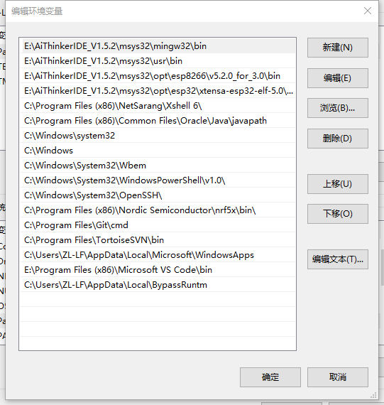

## 一 前言

众所周知，乐鑫ESP8266 SDK开发拥有多版本，包括带实时操作freeRtos系统开发，或者是裸跑开发 NONOS SDK，而这2钟方式又有版本的差异；

新手开发者不知道如何入门，那么我们为了兼容这些版本的差异和开发，为了满足更多开发者和降低门槛，我们一度地把原厂的window环境封装起来成为一个IDE，因此，我们推出了**《安信可 ESP8266/32 一体化IDE V1.5》**版本；

其特性有：

- 支持 ESP8266 的 NONOS 2.0和3.0 版本二次开发；
- 支持 ESP32 的 IDF 框架开发，支持 ESP-cam 开发板二次开发；
- 提供支持 天猫精灵IoT平台/阿里物联网生活平台/阿里飞燕/百度天工的模板SDK接入；
- 提供多种多样的demo项目，使开发者快速开发使用自己的业务；
- SDK资源开发包使用 Git 管理，用户可自行更新；

# 二 下载 IDE V1.5

&nbsp;&nbsp;&nbsp;&nbsp; 最近的百度网pan的下载速度一度再下降，为了换个方式存储IDE，所以，我们放在了群文件(最下面有加群方式)里面了。不过安装前，务必注意：

&nbsp;&nbsp;&nbsp;&nbsp; **第一点**：因为新版的IDE安装过程中会给电脑配置环境变量，所以，安装了**0.5或1.0**版本的朋友，请主动自行在电脑环境变量删除有关的`PATH`变量值，包含 `AiThinkerIDE_V1.0` 关键字的，比如：

```C
Ai-Thinker\AiThinkerIDE_V1.0\msys32\mingw32\bin
```
&nbsp;&nbsp;&nbsp;&nbsp; **第二点**：如果是采用我司的**0.5或1.0**版本来开发的项目，需自行删除工程根目录的 **.setting** 这个文件夹，因为他里面包含一些就旧工程配置。

&nbsp;&nbsp;&nbsp;&nbsp; **第三点**：环境依赖的是 python2.8 环境，而且 IDE （gui 环境）自带了 python2.8的环境的，如果你电脑有 py3 的环境，建议卸载或共存处理；

---------------------------------


&nbsp;&nbsp;&nbsp;&nbsp; 安装路径不要带中文字符或带空格:


-----------------

&nbsp;&nbsp;&nbsp;&nbsp; 最后，我们再次检查是否会自动添加环境变量，可以在电脑环境系统PATH变量查看仅有这几个数值即可：

```c
IDE安装路径\msys32\mingw32\bin
IDE安装路径\WinMY\msys32\usr\bin
IDE安装路径\WinMY\msys32\opt\esp8266\v5.2.0_for_3.0\xtensa-lx106-elf\bin
IDE安装路径\WinMY\msys32\opt\esp32\xtensa-esp32-elf-5.0\bin
```


-------------

# 三 编译一个 RTOS 操作系统代码

我们推荐各位学习 `ESP8266` 使用带操作系统SDK开发，不管用在商业或学习，必有值得借鉴的地方；

## 3.1 下载开发 SDK 资源包：

此SDK是基于官方的` RTOS master `分支上有所修改，并增加了开发模板，详情见 README 文档；
因为SDK和开发环境是分开的，所以下载的地方随心所欲；

但是强调：**下载路径务必不能带空格或中文字符**！


- 下载时候务必要把子模块拉取下来，不能直接点击 `download` 下载，否则得到的是一个不完整的开发包！！
- 所以，请自行百度教程安装 git 版本管理的软件；

```
git clone --recursive https://gitee.com/xuhongv/AiThinkerProjectForESP.git
```

## 3.2 导入安信可IDE

1. 点击C/C++分支，选择 `Existing Code as MakeFile Project` 工程;
2. 复制刚刚的下载的文件夹路径，`import -->  Cross Gcc` , 并且去掉对应的 `C++` 勾勾；

&nbsp;&nbsp;&nbsp;&nbsp; **主要步骤如下动图操作所示（忽略文件夹名字）：**


## 3.3 配置环境步骤：

 1. 项目属性设置，鼠标选中项目名称右键点击，在右侧菜单中选择Properties 
 2. 在 `Properties --> C/C++ Build --> Build directory` 选择编译的工程路径，比如 `examples\get-started\project_template` 工程。
 3. 添加IDF环境变量在 `Properties --> C/C++ Build --> Environment` 点击Add ，路径为刚刚的下载的文件夹路径，变量名字为 `IDF_PATH`;
 4. 然后点击 OK 保存退出！
 5. 控制台输出只保留 `Console` ，其他一律关闭！

 &nbsp;&nbsp;&nbsp;&nbsp; **主要步骤如下动图操作所示（忽略文件夹名字）：**


## 3.4 编译步骤：

&nbsp;&nbsp;&nbsp;&nbsp;与其他版本不一样， rtos3.0或以上支持面板设置参数，即通过 `make menuconfig` 设置，同样地，我们可以利用快捷键去快速设置；

 1. 构建menuconfig菜单，选中项目名称，在右键菜单中选择 `Make Targets --> Create`；或者快捷键 `Alt + F9` ;
 2. 在弹出的对话框中取消勾选`Same as the target name` 与 `User builder settings` 这2个选项，并且
在`Build command` 中输入`mintty.exe -e make menuconfig`。


&nbsp;&nbsp;&nbsp;&nbsp; **如下动图操作所示（忽略文件夹名字）：**


&nbsp;&nbsp;&nbsp;&nbsp; 然后，就可以编译工程了，点击 `Build Project`，编译过程需要的时间5分钟以上，取决电脑配置，耐心等待，当出现以下信息，说明编译成功！


## 3.5 下载步骤：
&nbsp;&nbsp;&nbsp;&nbsp; 配置快捷键进行下载，其命令是  `make flash` ，如果指定端口进行烧录下载固件比如 `com12` 的话，可以这样写： `make flash ESPPORT=COM12` ；

&nbsp;&nbsp;&nbsp;&nbsp; **如下动图操作所示（忽略文件夹名字）：**


&nbsp;&nbsp;&nbsp;&nbsp; 烧录完毕之后，日志打印会如下所示（忽略文件夹名字）：


# 四 编译 NONOS SDK V3.0/2.1.x/2.2.x版本

- 事前确定电脑环境变量是否成功`PATH`配置了如下变量(根据自己电脑路径有所差异)：


&nbsp;&nbsp;&nbsp;&nbsp;因为很多小伙伴在玩无操作系统开发（简称 **NONOS SDK**），而此 SDK 网上有2大版本流行，分别是 3.0 为一个划分界限，而我们的IDE也支持这样的开发兼容，下面先给大家讲解如何编译**NONOS 3.0 SDK**的！经测试，从仓库下载的下载的 **2.2.x** 和 **2.1.x** 分支，都可以用这个环境编译！

&nbsp;&nbsp;&nbsp;&nbsp;如果你的工程较久的话，直接参考下一节的配置。

&nbsp;&nbsp;&nbsp;&nbsp;首先克隆代码，这里我依然选择为用  `git` 拉取：
```C
git clone https://gitee.com/xuhongv/ESP8266_NONOS_SDK
```
### 导入步骤：

 1. 手动删除根目录下的```driver_lib```和 ```third_party```这2个文件夹；
 2. 然后点击C/C++分支，选择 `Existing Code as MakeFile Project` 工程;
 3. 复制刚刚下载文件的 `ESP8266_NONOS_SDK`的路径，import -->  Cross Gcc , 并且去掉对应的 C++ 勾勾；如下动图所示：


---------

### 编译步骤：

 1. 项目属性设置，鼠标选中项目名称右键点击，在右侧菜单中选择Properties ；
 2. 选择Properties --> C/C++ Build --> Build command 中添加编译规则，当前硬件是 32Mbit的模块，所以这样填：( `make COMPILE=gcc BOOT=none APP=0 SPI_SPEED=40 SPI_MODE=DIO SPI_SIZE_MAP=6` )；
 3. 在Properties --> C/C++ Build --> Build directory 选择编译的工程路径，比如根目录下的 IoT_Demo工程。
 4. 然后，就可以 清理工程 `clean Project` 和编译工程 `build Project` 了；
 5. 控制台输出只保留 Console ，其他一律关闭！


- 编译成功之后，从控制台看到：

```c
!!!
No boot needed.
Generate eagle.flash.bin and eagle.irom0text.bin successully in folder bin.
eagle.flash.bin-------->0x00000
eagle.irom0text.bin---->0x10000
!!!
```

------------------------

### 烧录

&nbsp;&nbsp;&nbsp;&nbsp;从官方下载烧录工具，插上安信可出的 nodemcu 模块，选择各个 bin 文件，如下的配置，先 `ERASE` ，再 `START` 即可：


&nbsp;&nbsp;&nbsp;&nbsp; 默认的打印波特率 74880 ，那么我们的电脑串口软件要支持 74880，下面以 SmarTTY 软件为例，如下打印，表示运行成功！


# 五、编译 NONOS SDK V2.0 版本或以下

&nbsp;&nbsp;&nbsp;&nbsp;上面已经讲解了如何编译 **3.0/2.2x/2.1.x**版本或以上的，这里就讲解如何编译**2.0**或更旧版本之间的代码。具体的工程也不再维护了，大家手上的应该是较久的一些版本把，比如技新课堂的教程工程等；


&nbsp;&nbsp;&nbsp;&nbsp;我们先下载一个压缩包 `plugin_cywin` 解压到安装目录，**导入前，务必更改环境变量**，在电脑的环境变量操作如下：
- **在PATH添加以下的环境变量**：

```
D:\Ai-Thinker_V1.5\plugin_cywin\bin
D:\Ai-Thinker_V1.5\msys32\opt\esp8266\v4.8.2_for_2.0\bin
```
- **在PATH删除以下的环境变量**：

```
D:\Ai-Thinker_V1.5\msys32\opt\esp8266\v5.2.0_for_3.0\xtensa-lx106-elf\bin
D:\Ai-Thinker_V1.5\msys32\mingw32\bin
D:\Ai-Thinker_V1.5\msys32\opt\esp32\xtensa-esp32-elf-5.0\bin
```

&nbsp;&nbsp;&nbsp;&nbsp;之后，重启打开 eclipse 软件，导入步骤和编译步骤和之前的和导入 **Non OS 3.0**版本的一样！修改后的路径如此：


# 六、常见问题

## Q1 编译`gen_appbin.py`文件报错

```
"../tools/gen_appbin.py", line 55
```

- 解决方法：因为编译环境依赖的是 `py2.7` 环境，如果您的电脑是 `py3` 版本的，会造成一些语法冲突，请在eclipse编译工程的环境配置去掉 `py3` 的环境路径，再次编译即可！

## Q2 编译有关`xtensa`的错误日志。

- 从主分支下载的代码都是最新的编译工具链的，请确保工具链是否在eclipse编译工程的环境配置里面！比如：

`~\Ai-Thinker_V1.5\msys32\opt\esp8266\v5.2.0_for_3.0\xtensa-lx106-elf\bin`


## Q3 编译有关`Permission denied`的错误日志。

- 因为部分win10系统，存在着不兼容环境变量情况！只需要把环境变量置顶即可解决！如下所示：




# 联系方式：

- 技术疑问请发疑问到邮箱： xuhongv@aithinker.com
